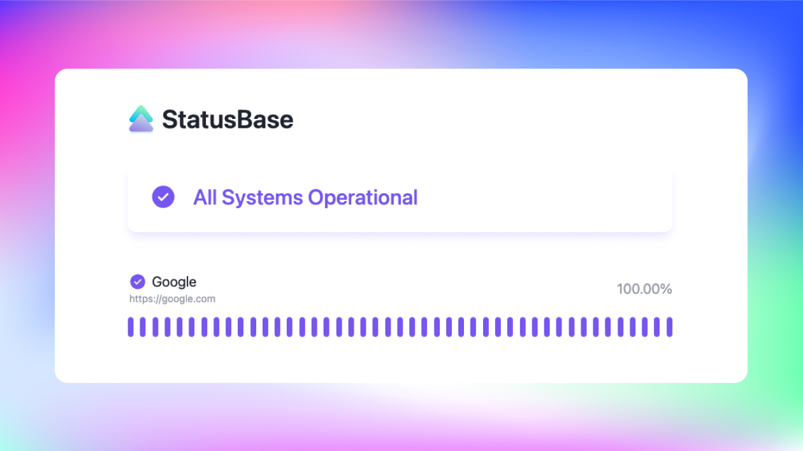

<!-- PROJECT LOGO -->
<br />
<p align="center">
  <a href="https://github.com/status-base/statusbase-supabase">
    
  </a>

  <h3 align="center">StatusBase (Supabase)</h3>

  <p align="center">
   Uptime monitoring tool & beautiful status pages <br><br> Powered by <a href="https://supabase.com/" target="_blank"> Supabase!</a>
    <br />
    <strong>Free • Open Source • Notification</strong>
    <br />
    <br />
    <a target="_blank" href="https://statusbase.vercel.app/">View Demo</a>
    ·
    <a target="_blank" href="https://github.com/status-base/statusbase-supabase/issues">Report Bug</a>
    ·
    <a target="_blank" href="https://github.com/status-base/statusbase-supabase/issues">Request Feature</a>
  </p>
</p>



## Inspiration

I saw a lot of Status Page Software-as-a-Service (SAAS) out there lately, but I want to create one that allow users to freely host it themselves, and configure it to their hearts content.

This is the [Supabase](https://supabase.com) version of Statusbase!

## 🚀 Features

- 🤩 Free
- 📖 Open-Source
- 🚀 Host it on [platforms](https://v3.nuxtjs.org/guide/deploy/presets)
- 🔔 Email notifications when site is down (WIP)

### 🔨 Built With

- [Nuxt 3](https://v3.nuxtjs.org/)
- [WindiCSS](https://windicss.org/)
- [Supabase](https://supabase.com/)

## Setup instructions

> **Warning**
> This project is still under development

1. Fork the repository
2. Add your Supabase's Project URL & Key to `.env`
3. Setup Edge function prerequisites by following [these steps.](https://supabase.com/docs/guides/functions#prerequisites)
4. Deploy `health_check` function using script `supabase functions deploy health_check`
5. Copy and paste this script in the same Supabase's project SQL Editor `https://app.supabase.com/project/<your-project-ref>/sql`

```sql
-- Create table
create table if not exists urls (
  id uuid default uuid_generate_v4() primary key,
  url text not null unique,
  title text not null,
  description text
);

create table if not exists logs (
  id uuid default uuid_generate_v4() primary key,
  url_id uuid references urls (id) on delete cascade,
  time timestamp with time zone default timezone('utc'::text, now()) not null,
  status text not null
);

create table if not exists incidents (
  id uuid default uuid_generate_v4() primary key,
  url_id uuid references urls (id) on delete cascade,
  created_at timestamp with time zone default timezone('utc'::text, now()) not null,
  resolved boolean,
  content text
);

-- Enable RLS
alter table urls enable row level security;
alter table logs enable row level security;
alter table incidents enable row level security;

-- Create policy to allow public to read
create policy allow_public_to_read on urls for select using (true);
create policy allow_public_to_read on logs for select using (true);
create policy allow_public_to_read on incidents for select using (true);

-- CRON Job
create extension if not exists pg_cron;
create extension if not exists http;
grant usage on schema cron to postgres;
grant all privileges on all tables in schema cron to postgres;

select
  cron.schedule(
    'health-check-every-15-minute', -- name of the cron job
    '*/15 * * * *', -- every 15 minute
    $$
    select content::json
    from
      http((
        'POST',
        'https://<your-project-ref>.functions.supabase.co/health_check',
        ARRAY[http_header('Authorization', 'Bearer <supabase-anon-key>')],
        'application/json',
        '{"hello": "world"}'
      )::http_request)
    $$
  );

```

6. Populate the `urls` table with any url you want to monitor.
7. Deploy site on any [platform](https://v3.nuxtjs.org/guide/deploy/presets)
8. Celebrate! 🎉

## ➕ Contributing

Contributions are what make the open source community such an amazing place to be learn, inspire, and create. Any contributions you make are **greatly appreciated**.

1. Fork the Project
2. Create your Feature Branch (`git checkout -b feature/AmazingFeature`)
3. Commit your Changes (`git commit -m 'Add some AmazingFeature'`)
4. Push to the Branch (`git push origin feature/AmazingFeature`)
5. Open a Pull Request

## 📜 License

Distributed under the MIT License. See `LICENSE` for more information.

# 📧 Contact

Zernonia - [@zernonia](https://twitter.com/zernonia) - zernonia@gmail.com

Also, if you like my work, please buy me a coffee ☕😳

<a href="https://www.buymeacoffee.com/zernonia" target="_blank">
  
</a>
